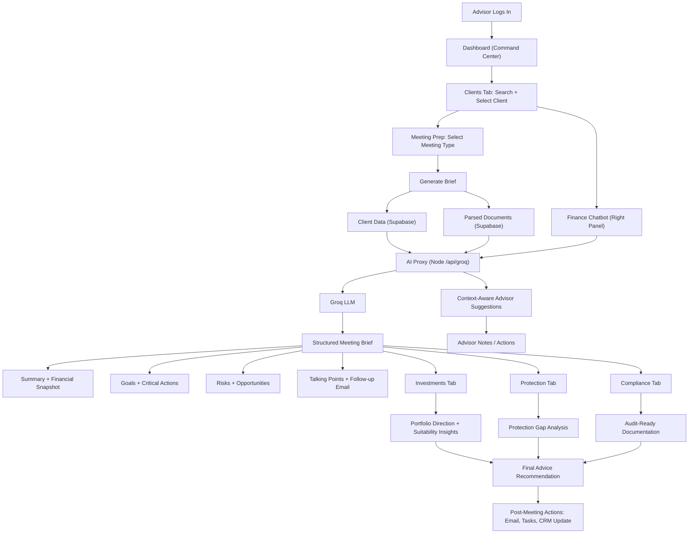

# JARVIS - Financial Advisor AI Assistant

**Live Demo:** https://jarvis-aai.vercel.app/  
**Video Demo:** https://youtu.be/ItM7L4wCHXE

## Problem Statement

Financial advisors face significant challenges managing client data, conducting portfolio reviews, and preparing for meetings. Traditional workflows are time-consuming and error-prone, leading to missed opportunities and inefficient client service.

## Solution

JARVIS is an AI-powered platform built to streamline financial advisory workflows. It automates document processing, generates intelligent insights, and helps advisors prepare comprehensively for client meetings.

## Solution Overview



### Core Features

- Intelligent document parsing that automatically extracts client data from Word documents
- AI-powered meeting preparation using Groq's LLaMA 3.3 70B model
- Portfolio analytics dashboard showing AUM, client statistics, and critical actions
- Advanced client management with search and filtering capabilities
- Critical action tracking for clients requiring immediate attention
- Meeting scheduler with integrated note-taking

## Tech Stack

### Frontend
- React 19.2.0 with modern hooks and patterns
- Vite 7.2.4 for fast development and optimized builds
- Custom CSS with Tailwind-inspired utilities
- Lucide React for consistent iconography
- Recharts for data visualization

### Backend
- Node.js runtime with Express for the API proxy
- Supabase (PostgreSQL) for database and real-time features
- Groq API integration for AI capabilities
- Mammoth.js for Word document processing

### AI/ML
- LLaMA 3.3 70B via Groq for natural language processing and structured data extraction

## Prerequisites

You'll need the following installed:
- Node.js (v18 or higher)
- npm (bundled with Node.js)
- Git

You'll also need accounts for:
- Groq API (free tier available at console.groq.com)
- Supabase (free tier at supabase.com)

## Local Setup

### 1. Clone the Repository

```bash
git clone https://github.com/yourusername/jarvis-advisor-ai.git
cd jarvis-advisor-ai
```

### 2. Install Dependencies

```bash
npm install
```

### 3. Configure Environment

Copy the example environment file:

```bash
cp .env.example .env
```

Edit the `.env` file with your credentials:

```env
# Groq API Key
GROQ_API_KEY=your_groq_api_key_here
VITE_GROQ_API_KEY=your_groq_api_key_here

# Server Configuration
PORT=8787
VITE_API_BASE=http://localhost:8787

# Supabase Configuration
VITE_SUPABASE_URL=your_supabase_project_url
VITE_SUPABASE_ANON_KEY=your_supabase_anon_key
```


### 4. Run the Application

Start both the backend and frontend simultaneously:

```bash
npm run dev:all
```

This starts:
- Frontend at http://localhost:5173
- Backend API proxy at http://localhost:8787

Alternatively, run them separately in different terminals:

```bash
# Terminal 1
npm run server

# Terminal 2
npm run dev
```

## Using the Application

### Adding a Client

Click the "Add Client" button and upload a Word document containing client information. The AI automatically extracts:
- Client identification details
- Total AUM and portfolio breakdown
- Investment and protection details
- Critical actions and review dates

### Preparing for Meetings

Navigate to the Meeting Prep tab, select a client, and click "Generate Brief". The system creates a comprehensive meeting analysis including client overview, discussion points, risk assessment, and recommended actions.

### Managing Clients

Use the search bar to find clients by name or ID. Apply filters for status (Active/Inactive) or urgency (Critical Actions). Click any client to view or edit their details, and use the scheduler to set review dates and add notes.

## Project Structure

```
jarvis-advisor-ai/
├── api/                    # API utilities and helpers
├── public/                 # Static assets
├── server/                 
│   └── index.js           # Groq API proxy server
├── src/
│   ├── components/        # React components
│   │   ├── Dashboard.jsx
│   │   ├── ClientList.jsx
│   │   ├── MeetingPrep.jsx
│   │   └── ...
│   ├── data/              # Static data and AI prompts
│   ├── lib/               
│   │   ├── db.js         # Supabase client
│   │   └── parsing.js    # Document parsing utilities
│   ├── App.jsx           
│   ├── index.css         
│   └── main.jsx          
├── .env.example          
├── package.json          
└── vite.config.js        
```

## Security Considerations

The `.env` file is automatically excluded from version control via `.gitignore`. Never commit API keys or credentials to the repository. For production deployments, implement proper Row Level Security policies in Supabase and use environment-specific configurations.

## Deployment

### Frontend Deployment (Vercel/Netlify)

1. Connect your GitHub repository to your hosting platform
2. Configure environment variables in the platform dashboard
3. Set build command to `npm run build`
4. Set output directory to `dist`

### Backend Deployment (Railway/Render)

Deploy the `/server` directory to your preferred platform and set the `GROQ_API_KEY` environment variable. Update `VITE_API_BASE` in your frontend environment to point to the deployed backend URL.

## Known Limitations

This is a proof-of-concept built for demonstration purposes. Production use would require additional features including comprehensive error handling, data validation, user authentication, audit logging, and regulatory compliance features.

## License

Created for hackathon submission - February 2026
